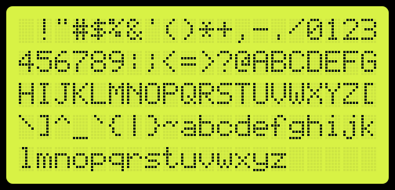

# LCD Screenshot Generator

This is a LCD Screenshot Generator using Python, that generates
SVG images representing a LCD display.



# Installation

## Fehler

Fehler 1:

```
qt.qpa.plugin: From 6.5.0, xcb-cursor0 or libxcb-cursor0 is needed to load the Qt xcb platform plugin.

qt.qpa.plugin: Could not load the Qt platform plugin "xcb" in "" even though it was found.
```

Lösung:

```
sudo apt update

sudo apt install libxcb-cursor0
```
